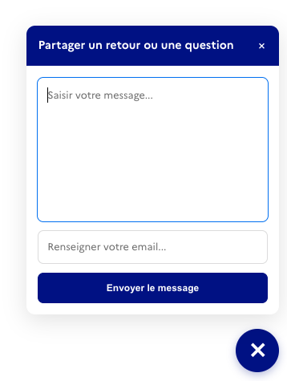

<div style="width:300px;margin:auto;">

</div>

Ce widget permet aux visiteurs de votre service d'envoyer des questions ou des retours à votre équipe.

Ces retours sont ensuite consultables dans une instance de [Messages](https://github.com/suitenumerique/messages), 
qui permet d'y répondre collaborativement par email.


## Intégration

Il y a deux façons principales d'intégrer ce widget dans votre service:

### 1. Via le composant React

Ce composant sera bientôt disponible dans le [UI Kit](https://github.com/suitenumerique/ui-kit).

En attendant, vous pouvez :
* soit [copier ce composant](https://github.com/suitenumerique/messages/blob/main/src/frontend/src/features/ui/components/feedback-widget/index.tsx)
si vous souhaitez intégrer la pop-in de retour avec son bouton de chargement qui s'affiche en bas à droite des pages,
* soit [copier ce composant](https://github.com/suitenumerique/messages/blob/main/src/frontend/src/features/ui/components/feedback-button/index.tsx)
si vous souhaitez juste ouvrir la pop-in de retour dynamiquement, avec un bouton existant de votre application par exemple.

### 2. Via le script JavaScript

Cette option est à privilégier si vous n'utilisez pas React ou si vous ne souhaitez pas intégrer l'UI Kit dans votre application.

Voici comment l'intégrer avec le bouton de chargement :

```html
<script src="https://cdn.votresuite.fr/loader.js" async></script>
<script>
window._stmsg_widget = window._stmsg_widget || [];
 _stmsg_widget.push(["loader", "init", {
    "params": {
        "api": "https://votre.instance.de.messages/api/",
        "channel": "xyz-xyz-xyz"
    },
    "script": "https://cdn.votresuite.fr/feedback.js",
    "scriptType": "module",
    "widget": "feedback",
    "label": "Poser une question"
}]);
</script>
```

D'autres exemples d'intégration sont disponibles ci-dessous.

## Exemples

Nous avons une documentation interactive avec plusieurs exemples de configuration pour :
 * [version avec bouton de chargement](/widgets-demo/loader).
 * [version sans bouton de chargement](/widgets-demo/feedback).

Vous pouvez aussi tester La Gaufre v2 en ligne sur ces services :

* [Suite territoriale - site vitrine](https://suiteterritoriale.anct.gouv.fr/)
* [Suite territoriale - Messages](https://messages.suite.anct.gouv.fr)
