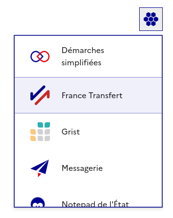
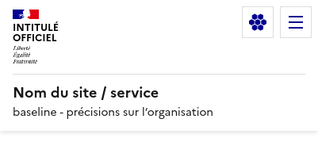

import { Aside } from "@astrojs/starlight/components"
import assetGaufre from "./gaufre.png"
import { Code } from "@astrojs/starlight/components"
import gaufreHtml from "@gouvfr-lasuite/integration/dist/html/gaufre.html?raw"



Le bouton "Gaufre" est un élément d'interface commun à tous les services de La Suite numérique. Il
permet aux internautes de facilement passer d'un service de La Suite à un autre.

Pour intégrer la Gaufre, il y a trois étapes :

- intégrer le HTML du bouton
- ajouter le fichier CSS nécessaire
- ajouter le fichier JS chargeant le widget au clic du bouton

:::note

Ce guide est à suivre pour intégrer la Gaufre sur toute page autre que
[votre page d'accueil](../homepage). Le gabarit de page d'accueil inclut déjà le bouton.

:::

## Règles d'utilisation

Le bouton Gaufre est destiné à être présent dans le coin supérieur droit de la page de votre page
web afin d'être toujours placé au même endroit quelque soit le service.

### Sur écran mobile/tablette

Sur petit écran, il est préférable d'afficher le bouton Gaufre en dehors d'un potentiel menu burger
existant, à gauche du menu burger :



Si pour quelconque raison ceci n'est pas possible, rajoutez un élément dans votre menu burger pour
accéder aux services de La Suite (voir section [bouton customisé](#bouton-customisé)).

## Installation

Avant toute chose, suivez [le guide de démarrage](/guides/getting-started/#installation) pour
ajouter le code dans votre projet.

### 1. HTML

#### Avec React

Si vous utilisez React, utilisez le composant `Gaufre` fourni par le paquet :

```jsx
import { Gaufre } from "@gouvfr-lasuite/integration"

function MonComposant() {
  return <Gaufre />
}
```

Vous pouvez passer une prop `variant` au composant Gaufre pour changer l'affichage du bouton :

- `variant="responsive"` : le bouton s'affiche plus petit sur écran mobile/tablette
- `variant="small"` : le bouton s'affiche plus petit, tout le temps. **Ceci est la variante
  recommandée si vous utilisez une entête DSFR**.

:::note

Même en utilisant React, vous devrez charger le CSS et le JS manuellement. Ce petit travail
supplémentaire est fait pour vous donner plus de contrôle sur le chargement des assets suivant votre
stack technique.

:::

#### Sans React

Si vous n'utilisez pas React, utilisez le HTML présent dans le paquet :

<Code code={gaufreHtml} lang="html" title="@gouvfr-lasuite/integration/dist/html/gaufre.html" />

- ajouter une classe `lasuite-gaufre-btn--responsive` pour afficher le bouton plus petit sur écran
  mobile/tablette
- ajouter une classe `lasuite-gaufre-btn--small` pour afficher le bouton plus petit, tout le temps.
  **Ceci est recommandé si vous utilisez une entête DSFR**.

#### Dans une entête DSFR

Si vous intégrez le bouton Gaufre dans un projet suivant le DSFR :

- rajoutez le bouton en 1er enfant de `div.fr-header__navbar` pour que le bouton s'affiche à gauche
  du menu burger sur petit écran,
- puis en dernier élément de la liste `.fr-header__tools > .fr-header__tools-links > .fr-btns-group`
  pour que le bouton s'affiche en haut à droite de l'écran sur grand écran.

N'oubliez pas d'utiliser la classe `lasuite-gaufre-btn--small` pour que la taille du bouton
corresponde avec le reste de l'entête.

### 2. CSS

Le CSS nécessaire est présent dans `@gouvfr-lasuite/integration/dist/css/gaufre.css`. Il est à
inclure dans votre projet comme n'importe quel fichier CSS.

Suivant votre stack technique, vous pouvez peut-être inclure directement le CSS depuis les
dépendances. Par exemple avec _vite_ :

<Code
  code={`@import "@gouvfr-lasuite/integration/dist/css/gaufre.css";`}
  lang="css"
  title="vos/styles/globaux/app.css"
/>

Si vous n'utilisez pas de _bundler_ particulier et que avez plutôt décidé à l'installation de
[copier les assets](/guides/getting-started/#gestion-des-assets), vous pouvez inclure le CSS
directement via une balise `link` comme tout fichier CSS.

### 3. JS

Après avoir ajouté le bouton, il est nécessaire de le faire fonctionner. Pour ça, chargez ce fichier
JS externe qui s'occupe d'afficher le widget au clic du bouton. Vous pouvez ajouter ce code dans
votre `<head>` :

<Code
  code={`<script id="lasuite-gaufre-script" async defer src="${import.meta.env.PUBLIC_LASUITE_API_URL}/api/v1/gaufre.js"></script>`}
  lang="html"
/>

Si vous voulez afficher la liste des services de La Suite territoriale, remplacez `src` par :

<Code code={`${import.meta.env.PUBLIC_LASUITE_API_URL}/api/v1/gaufre.js?type=local`} lang="text" />

:::note

Pour que le script fonctionne il est nécessaire qu'il ait un id `lasuite-gaufre-script`. Ne
l'enlevez pas en copiant l'exemple !

:::

### 4. Content Security Policy

Si vous utilisez une [stratégie CSP](https://developer.mozilla.org/fr/docs/Web/HTTP/CSP), vous devez
ajoutez des règles pour ne pas avoir d'erreurs au chargement du bouton Gaufre. Le bouton se connecte
à l'API d'intégration via un script, charge des images et charge une police de caractères embarquée
:

- `connect-src https://integration.lasuite.numerique.gouv.fr/`
- `script-src https://integration.lasuite.numerique.gouv.fr/`
- `font-src https://integration.lasuite.numerique.gouv.fr/`
- `img-src https://integration.lasuite.numerique.gouv.fr/`

## Bouton customisé

Si vous ne voulez pas utiliser le bouton Gaufre standard, vous pouvez créer votre propre bouton avec
vos propres styles.

Cela est nécessaire si vous voulez par exemple avoir une ligne "Services de La Suite" dans un menu
burger : aucun HTML n'est proposé pour ça, tant il dépend de votre site.

- ⚠ pour que le bouton fonctionne, il doit avoir une classe `js-lasuite-gaufre-btn` pour que le
  JavaScript d'initialisation détecte votre bouton,
- parmi les classes CSS fournis, vous pouvez réutiliser `lasuite-gaufre-mask-element` ou
  `lasuite-gaufre-mask` qui appliquent l'icône de la Gaufre via un `mask-image` à l'instar des
  icones dans le DSFR,
- ℹ le bouton standard ne s'affiche que si le script de la Gaufre a réussi à charger. Pour avoir le
  même comportement sur votre propre implémentation, vous pouvez vous appuyer sur la présence de la
  classe `lasuite--gaufre-loaded` sur la balise `html`.

### Popup customisée

Au delà du bouton, suivant votre stack technique, vous voudrez peut-être utiliser un composant de
popup déjà en place dans votre app. Dans ce cas, une solution est de ne pas charger le script
proposé, et de gérer vous-même le comportement du bouton.

Le contenu à afficher dans la popup est requêtable directement sur
[{import.meta.env.PUBLIC_LASUITE_API_URL}/api/v1/gaufre](/api/v1/gaufre). La liste est déjà
construite pour vous en HTML/CSS car son affichage est amené à évoluer au fil du temps suivant le
nombre de services. Il n'est pas souhaitable de demander à chaque service de La Suite de devoir se
mettre à jour régulièrement. L'idée est donc de requêter cette URL, récupérer son `<body>` et de
l'intégrer dans votre DOM dans le contenu de votre composant de popup.

Appliquez la classe `lasuite--gaufre-borderless` sur votre balise `html` ou `body`. Ceci fera que la
liste fournie via l'URL ci-dessus, une fois dans votre DOM, n'affichera pas de bordure bleue avec
une ombre, et s'intégrera mieux dans votre composant de popup.

:::caution

Il est vivement déconseillé de surcharger les CSS du contenu de la popup de la Gaufre, car les
contenus de la popup et leur disposition visuelle évoluent avec le temps.
[Contactez-nous](/about/help) si vous avez des besoins particuliers par rapport à votre service.

:::

## Exemple

[La Gaufre : exemple HTML](/examples/gaufre/html).
