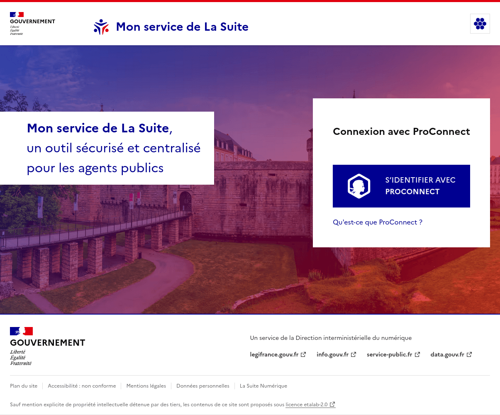

import { Tabs, TabItem } from "@astrojs/starlight/components"

Utilisez les composants d'interface prêt-à-l'emploi pour votre service de La Suite numérique.

## Présentation

Nous mettons à disposition plusieurs composants.

### Gabarit de page d'accueil



Le gabarit de page d'accueil permet de rapidement intégrer dans le code de votre service une page
d'accueil suivant un visuel commun avec tous les autres services de La Suite.

### _La Gaufre_, le bouton des services


Le bouton de La Suite numérique permet aux internautes de facilement passer d'un service de La Suite
à un autre.

Tous ces éléments sont disponibles via :

- des gabarits HTML, utilisables au choix via des **composants React** ou directement via des
  **fichiers .html**,
- **du CSS** nécessaire à afficher correctement les gabarits HTML,
- et une **API web** exposant plusieurs _endpoints_.

## Installation

### Via NPM

Le plus simple pour accéder au code est d'installer le paquet npm avec votre gestionnaire de paquets
préféré :

<Tabs>
<TabItem label="npm">

```sh
npm install @gouvfr-lasuite/integration
```

</TabItem>
<TabItem label="Yarn">

```sh
yarn add @gouvfr-lasuite/integration
```

</TabItem>
<TabItem label="pnpm">

```sh
pnpm add @gouvfr-lasuite/integration
```

</TabItem>
</Tabs>

### Manuellement

À la place d'utiliser npm, vous pouvez télécharger directement les fichiers depuis le dépôt sur
GitHub :

- allez sur https://github.com/numerique-gouv/lasuite-integration/releases,
- téléchargez le fichier `gouvfr-lasuite-integration-x.x.x.tgz` de la dernière release.

### Gestion des assets

Quand vous voudrez utiliser les assets fournis par le paquet, vous aurez peut-être besoin de copier
les assets dans un dossier accessible par votre serveur web, suivant votre stack technique.

Tous les fichiers exposés par le paquet npm sont dans son dossier `dist/`.

Si vous utilisez déjà _webpack_, _vite_ ou alternative, vous pourrez importer les fichiers CSS
directement depuis votre code comme tout autre CSS venant des dépendances. Par exemple avec _vite_ :

```js
// dans un fichier JS :
import '@gouvfr-lasuite/integration/dist/css/gaufre.css';
// ou dans un fichier CSS :
@import "@gouvfr-lasuite/integration/dist/css/gaufre.css";
```

Si vous n'utilisez pas de bundler, une façon simple de rendre accessible le code du paquet est
d'avoir un script qui copie pour vous les fichiers nécessaires dans un dossier accessible par votre
serveur web. Par exemple, rajouter ceci dans votre `package.json` copiera les fichiers du paquet
dans un dossier `public/@gouvfr-lasuite/integration` après chaque installation :

```diff lang="json"
"scripts": {
+  "copy-lasuite-assets": "cp -r node_modules/@gouvfr-lasuite/integration/dist/ public/@gouvfr-lasuite/integration",
+  "postinstall": "npm run copy-lasuite-assets"
}
```

Une fois les fichiers installés, vous êtes prêt à utiliser les composants fournis par le paquet !
